# GitLab Mirror Repository

## Introduction

This project demonstrates how to configure **GitLab Repository Mirroring** to automatically synchronize code from a GitLab repository to a GitHub repository.

Repository mirroring is useful when GitLab is used as the primary source control platform while maintaining a backup or public copy of the repository on GitHub. Any changes pushed to GitLab are automatically mirrored to GitHub.

---

## Project Objective

To establish a one-way repository mirroring setup from GitLab to GitHub and verify that all code changes pushed to GitLab are automatically reflected in GitHub.

---

## Prerequisites

Before starting, ensure you have:

- Git installed on your local machine
- GitLab account
- GitHub account
- Visual Studio Code (VS Code)
- Internet connection

---

## Step 1: Create a Repository in GitLab

1. Log in to GitLab.
2. Click **New Project**.
3. Select **Create Blank Project**.
4. Enter the repository name.
5. add Readme.md file and Click **Create Project**.

Example:

```text
gitlab-mirror-repo
```
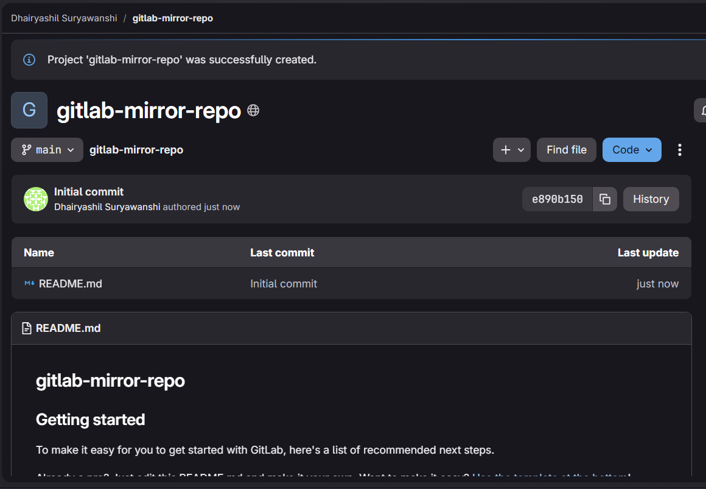

---

## Step 2: Create a Repository in GitHub

1. Log in to GitHub.
2. Click **New Repository**.
3. Enter the repository name.
4. add Readme.md file and Click **Create Repository**.

Example:

```text
gitlab-mirror-repo
```
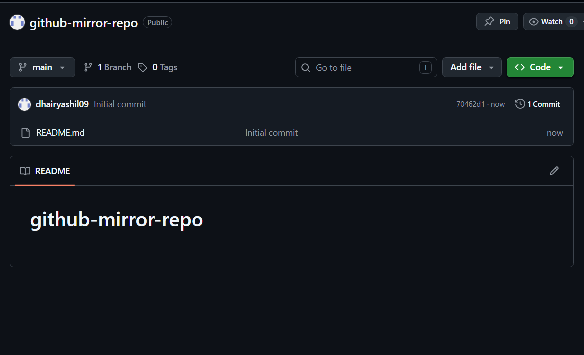
---

## Step 3: Configure Repository Mirroring in GitLab

1. Open your GitLab repository.
2. Navigate to:

```text
Settings → Repository
```

3. Scroll down to:

```text
Mirroring Repositories
```

4. Click:

```text
Add New
```

5. Copy the HTTPS URL of your GitHub repository.

Example:

```text
https://github.com/username/gitlab-mirror-repo.git
```

6. Paste the URL into the Mirror Repository URL field.

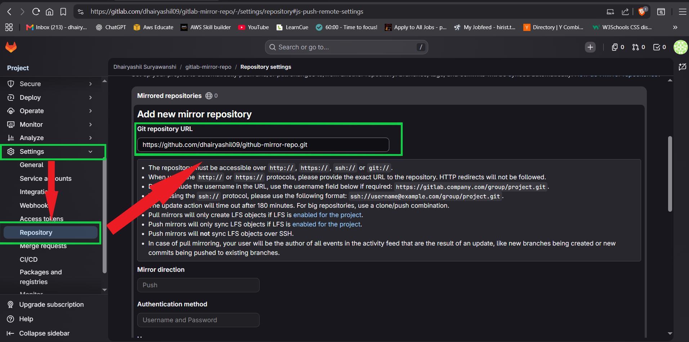

---

## Step 4: Generate a GitHub Personal Access Token

Since GitHub no longer supports password authentication for Git operations, a Personal Access Token (PAT) is required.


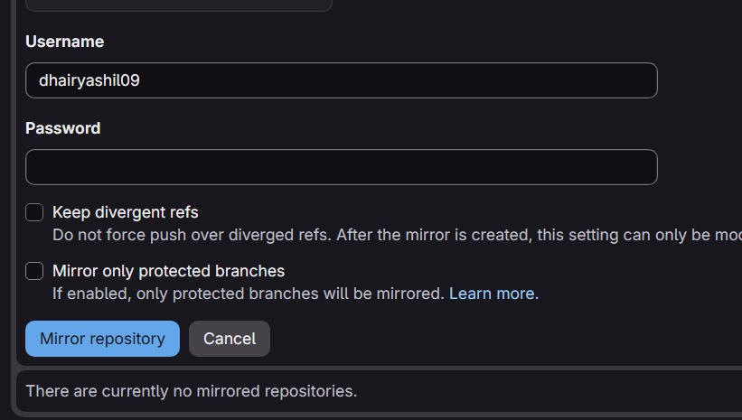


Navigate to:

```text
GitHub → Settings → Developer Settings → Personal Access Tokens → Tokens (Classic)
```

Click:

```text
Generate New Token (Classic)
```

Verify your GitHub account if prompted.

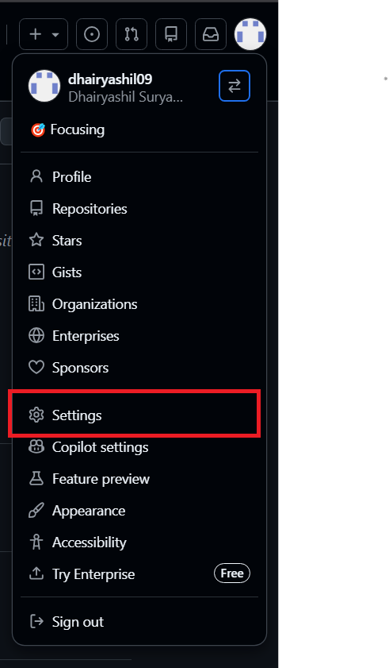
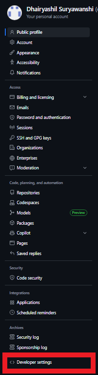
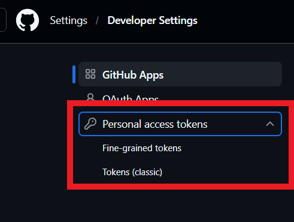
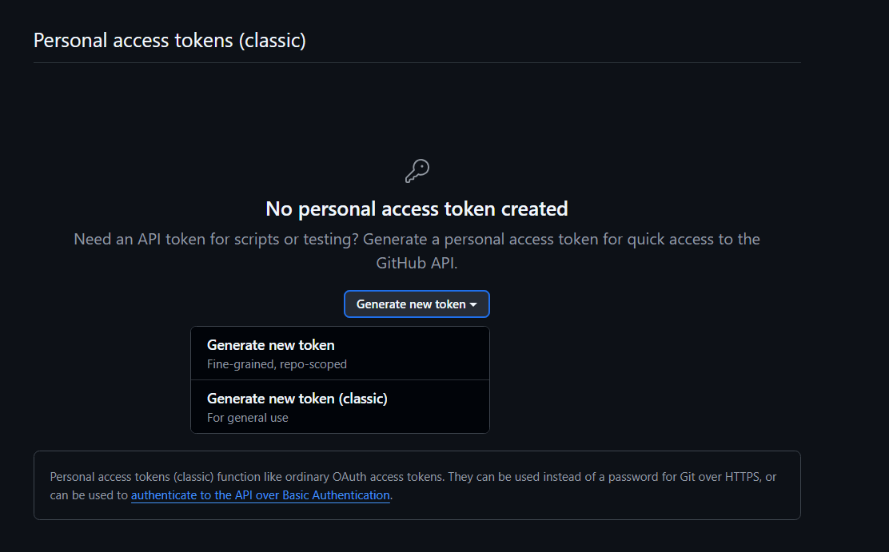
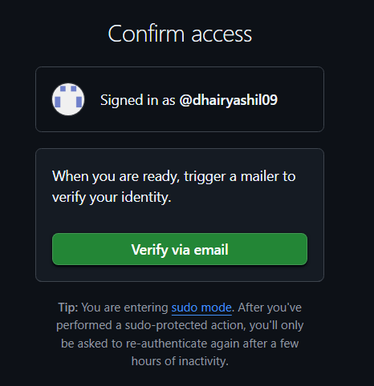
---

## Step 5: Configure Token Permissions

1. Enter a token note.

Example:

```text
GitLab Mirroring Token
```

2. Set expiration:

```text
No Expiration
```

3. Select the following scope:

```text
repo
```

4. Scroll down and click:

```text
Generate Token
```

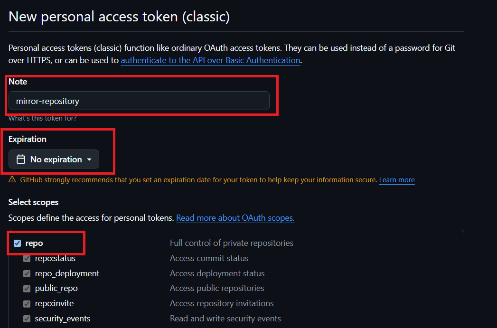
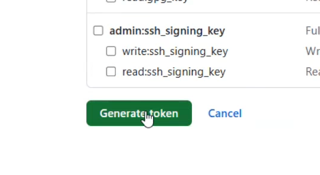


---

## Step 6: Configure Authentication in GitLab

1. Copy the generated GitHub Personal Access Token.
2. Return to the GitLab Mirroring Repository settings.
3. Enter the following credentials:

### Username

```text
Your GitHub Username
```

### Password

```text
Your GitHub Personal Access Token
```

4. Save the configuration.

The mirror repository entry should now appear in GitLab.

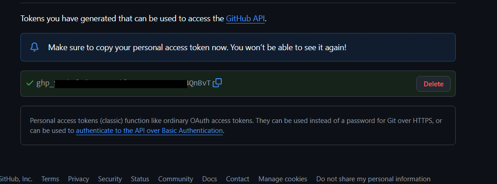
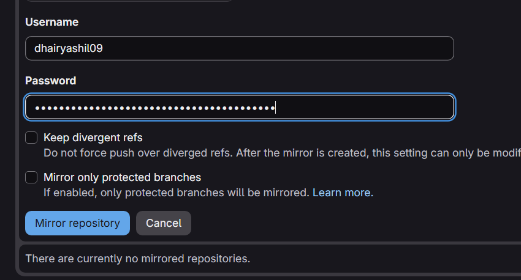
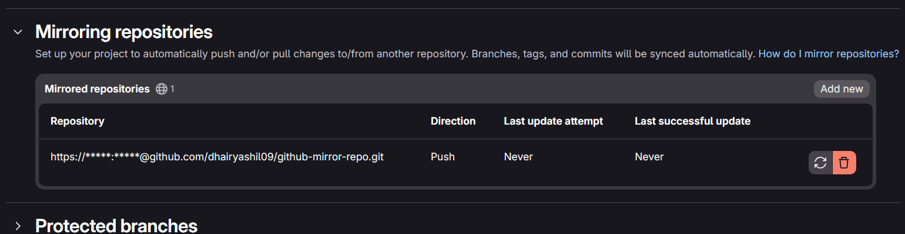

---

## Step 7: Clone the GitLab Repository Locally

1. Create a workspace folder.

Example:

```text
C:\Workspace
```

2. Right-click inside the folder.
3. Select:

```text
Git Bash Here
```

4. Clone the GitLab repository:

```bash
git clone https://gitlab.com/username/gitlab-mirror-repo.git
```

5. Navigate into the repository:

```bash
cd gitlab-mirror-repo
```

6. Open Visual Studio Code from git bash:

```bash
code . ; exit
```

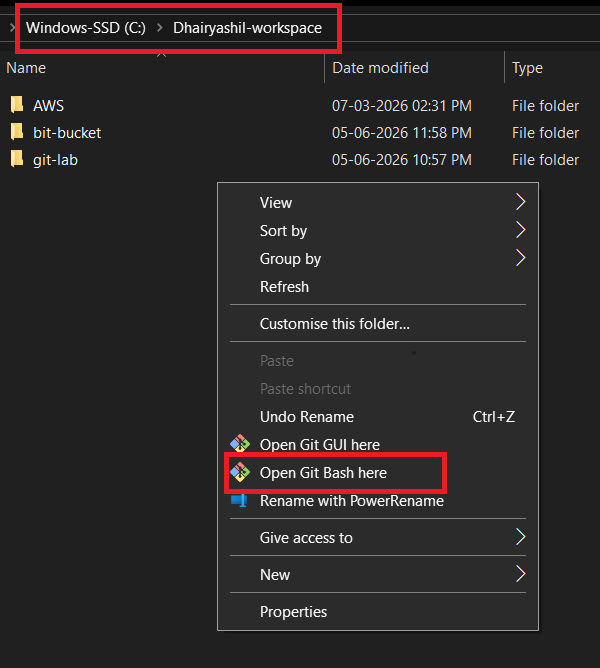
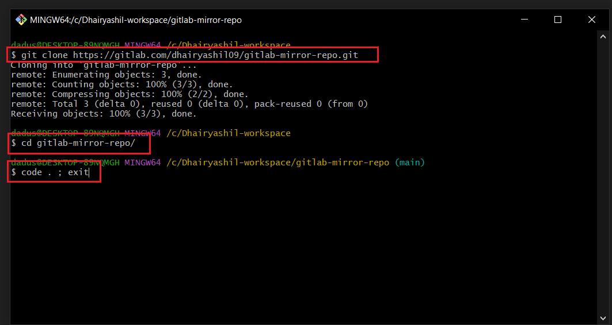

---

## Step 8: Create a Sample File

Create a file named:

```text
gitlab.html
```

Add the following content:

```html
<!DOCTYPE html>
<html>
<head>
    <title>GitLab Mirror Demo</title>
</head>
<body>
    <h1>GitLab Repository Mirroring Successful</h1>
</body>
</html>
```

Open the VS Code bash terminal.

---

## Step 9: Commit and Push Changes

### Add Files to Staging Area

```bash
git add .
```

### Commit Changes

```bash
git commit -m "added gitlab.html"
```

### Push Changes to GitLab

```bash
git push -u origin main
```
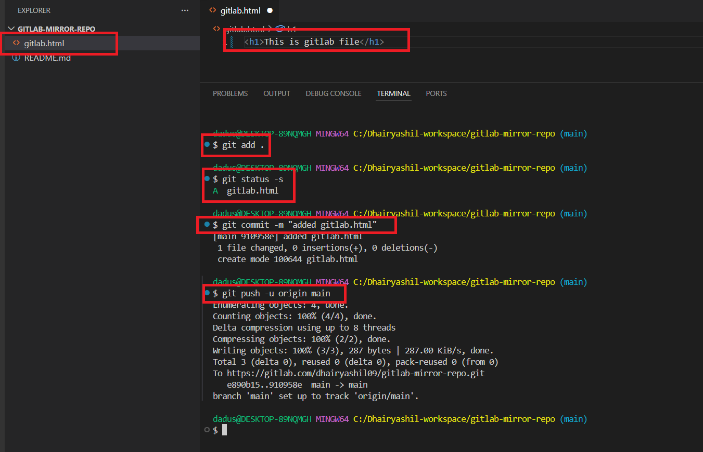
---

## Step 10: Verify Repository Mirroring

1. Open the GitLab repository.
2. Verify that the file has been successfully pushed.
3. Open the GitHub repository.
4. Confirm that the same file appears automatically.

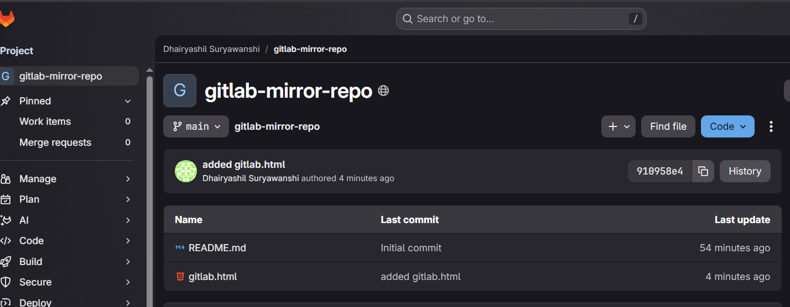
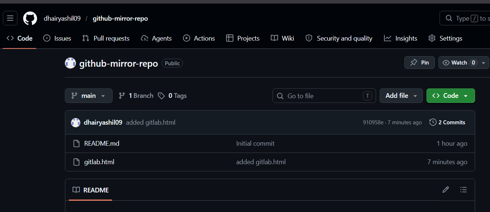

### Expected Flow

```text
Local Machine
      │
      ▼
GitLab Repository
      │
      ▼
Repository Mirroring
      │
      ▼
GitHub Repository
```

The file pushed to GitLab should automatically appear in GitHub.

---

## Git Commands Used

```bash
git clone https://gitlab.com/username/gitlab-mirror-repo.git

git add .

git commit -m "added gitlab.html"

git push -u origin main
```

---

## Project Architecture

```text
+----------------+
| Local Machine  |
+----------------+
        |
        ▼
+----------------+
| GitLab Repo    |
+----------------+
        |
        ▼
+----------------+
| Mirroring      |
+----------------+
        |
        ▼
+----------------+
| GitHub Repo    |
+----------------+
```

---

## Outcome

Successfully configured GitLab Repository Mirroring to automatically synchronize code changes from GitLab to GitHub using GitHub Personal Access Token authentication.

### Benefits

- Automatic synchronization between GitLab and GitHub
- Repository backup and redundancy
- Public code sharing through GitHub
- Centralized development workflow
- Improved source code management

---

## Author

**Dhairyashil Suryawanshi**
